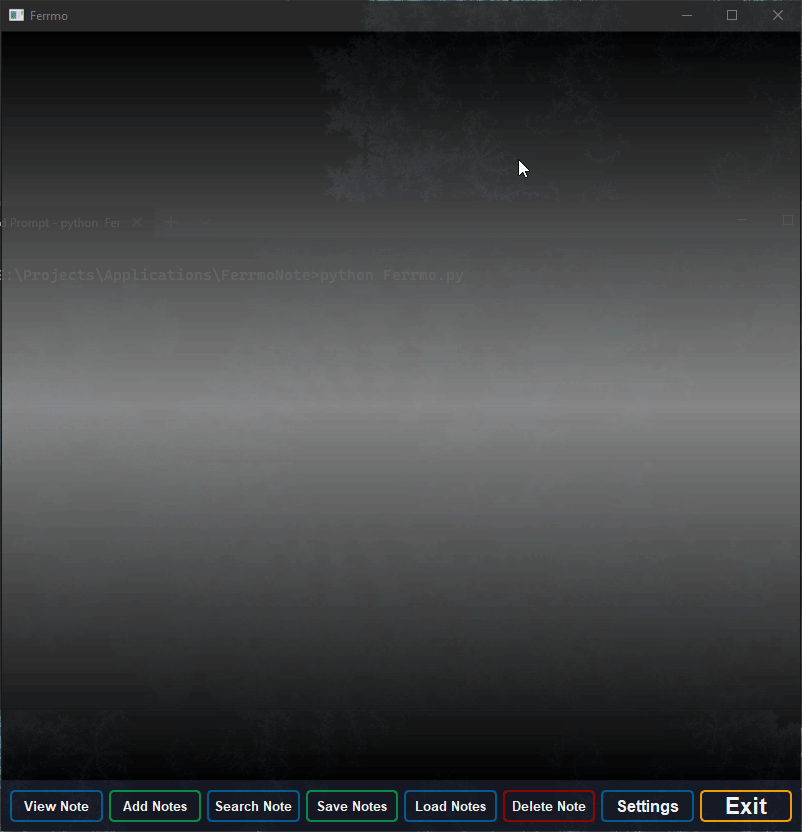

# FerrmoNote
   
<a href="https://circleci.com/gh/badges/shields/tree/master">
    </a>
<a href="https://circleci.com/gh/badges/daily-tests">

## This application is currently still in development
If you'd like to contribute to this project, please feel free to create an issue for the better development of this project. <br/>
It will support dynamic note management for the user to manage their information based on their needs. <br/>
This project is currently very early in development <br/>
 <br/>


### Installation...
```commandline
$ conda create -n FerrmoNote python==3.10

$ conda activate FerrmoNote

$ pip install -r requirements.txt
```

### Running...
```commandline
$ python Ferrmo.py
```
